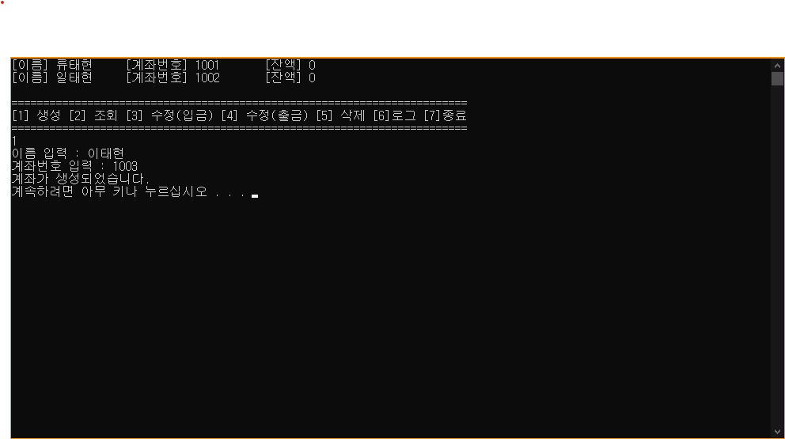
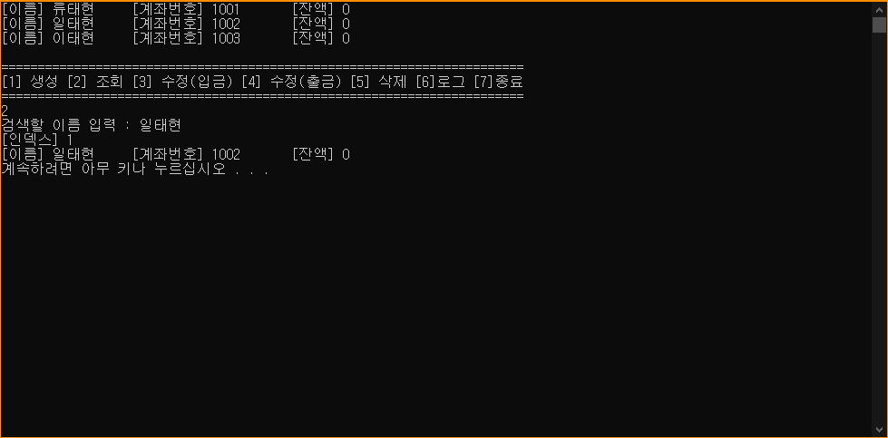
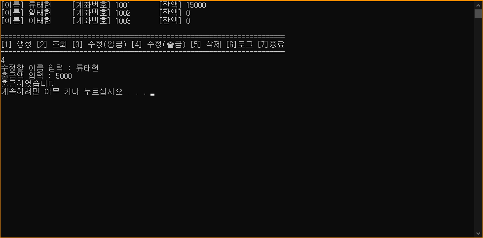
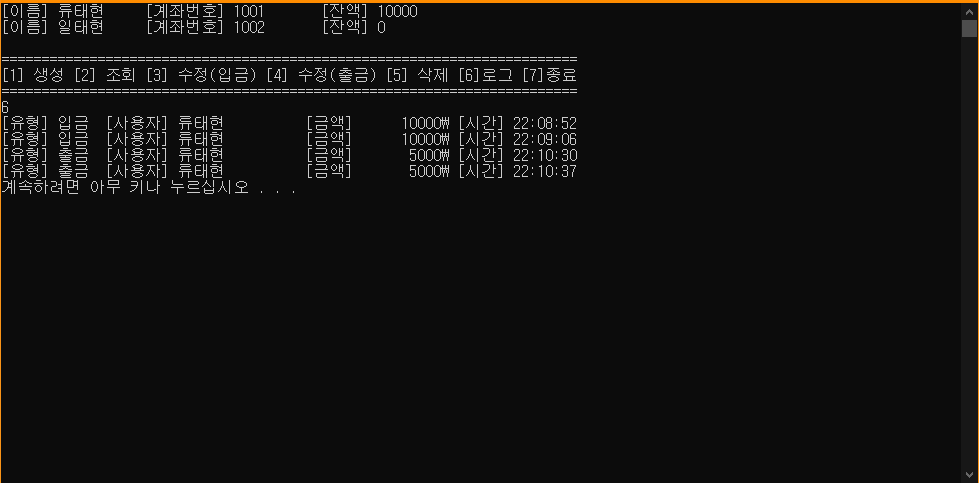

# AccountManager_cpp
* 계좌 관리 프로그램

## 개요
* 계좌정보를 받아 입금, 출금, 삭제기능을 제공하는 계좌 관리 프로그램

## 개발 목적
* 비트 단기과정 개인과제 - C++에서 사용하는 배열(동적메모리 개념)을 응용하는 과제

## 개발 기간
* 2016.07.22

## 기술 스택
* C++

## 개발 환경
* OS : Windows 8.1
* IDE : Visul Studio 2015

## 실행 화면
* 계좌 개설

* 계좌 조회

* 입금

* 출금

* 로그

